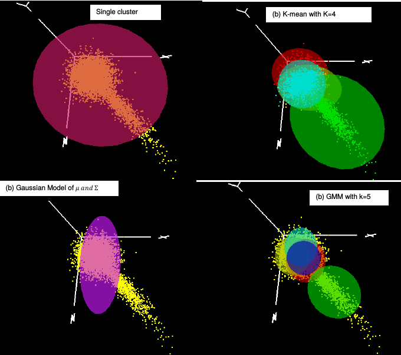

## Multivariate Elliptical Distribution and Clustering Algorithm Visualization in 3D
Visualizing 3D clustering/AD algorithms using OpenGL.

Algorithms included
- K-mean algorithm
- Gaussian Mixture Model (GMM)
- Single Gaussian Model.

**Required**
- Armadillo 7.5 or later
- Glut and OpenGL libraries.
- g++ 4.9 or compiler with C++11 support.

**Build**

`cmake .. && make`

**Usage**

ADCvisualization [-h] [options]                   

Anomaly detection and clustering algorithm visualization tool.

    --help, -h   Display this help message and exit.
    --knn, -k    Number of cluster for K-mean algorithm
    --gmm, -g    Number of cluster in GMM.
    --nsample, n Generate N sample size for synthetic data. Default 1000
    --ncluster, c   Number of synthetic cluster to use. Default 3
    --metric, m     Cluster radius metric calculation.0-mean,1-median , 2-max. Default MAX of distance from center
    --input, -i   Input data. 3D data with X, Y,Z value separated by comma`

